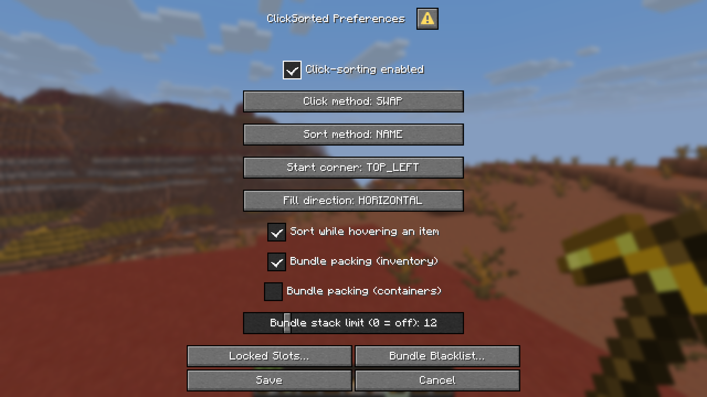

# Preferences Menu

Run `/clicksorted menu` to open a single screen listing every sorting preference at once, instead of setting them one command at a time.

<!-- TODO: replace with a real screenshot of /clicksorted menu -->

## What's in the menu

| Field | Same as |
|---|---|
| Click-sorting enabled | `/clicksorted sort enabled` |
| Click method | `/clicksorted click method` |
| Sort method | `/clicksorted sort method` |
| Start corner | `/clicksorted sort start-corner` |
| Fill direction | `/clicksorted sort fill-axis` |
| Sort while hovering an item | `/clicksorted click allow-on-hover` |
| Bundle packing (inventory) | `/clicksorted bundle enabled in-inventory` |
| Bundle packing (containers) | `/clicksorted bundle enabled in-containers` |
| Bundle stack limit | `/clicksorted bundle stack-limit` |

A field only appears if you have permission to change it by command — if your server has restricted, say, sort method, you won't see a sort method selector either.

The "sort while hovering an item" field is hidden whenever your current click method controls it automatically (see [Getting Started](getting-started.md#sorting-over-occupied-slots)).

Nothing is applied until you click **Save**. **Cancel** discards every change on the screen.

## Locked Slots… and Bundle Blacklist… buttons

Slot locking and the bundle blacklist are their own GUIs (see [Locking Slots](slot-locking.md) and [Bundle Packing](bundle-packing.md)) — they don't fit as simple menu fields. Clicking either button opens that GUI directly from the menu.

Any changes you've made on the menu screen but haven't saved yet are held onto while that GUI is open. Once you close it, the preferences menu reappears with those unsaved changes still in place, so you can keep adjusting settings and save everything together at the end.

## Bedrock/Geyser players

This menu is a server-side dialog, which Bedrock/Geyser clients can't display. If you're on Bedrock, use the [commands](commands.md) instead — every preference the menu offers is also available as a command.
